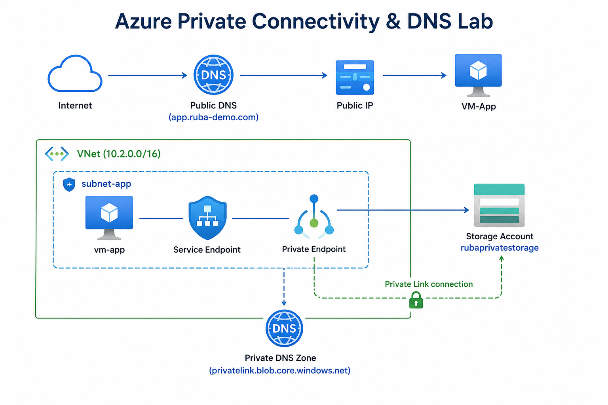

# Step-by-Step Guide - Azure Private Connectivity & DNS Lab

This guide walks you through building a secure private connection to Azure Storage Account using **Private Link** and **Private DNS**.

## 🎯 Scenario
A company wants to host files in Azure Storage with limited public exposure and secure internal access from inside the VNet.

## 🏗️ Architecture



---

### STEP 1 — Create Resource Group
1. Go to **Resource groups** → **+ Create**
2. Settings:
   - **Name**: `rg-private-connectivity`
   - **Region**: **UAE North**
3. Click **Review + create** → **Create**

### STEP 2 — Create Virtual Network
1. Search for **Virtual networks** → **+ Create**
2. Basics:
   - Resource group: `rg-private-connectivity`
   - Name: `vnet-private`
   - Region: **UAE North**
3. IP Addresses:
   - Address space: `10.2.0.0/16`
   - Delete the default subnet
4. Click **Create**

### STEP 3 — Create Subnet
Inside `vnet-private`:
- **Name**: `subnet-app`
- **Address range**: `10.2.1.0/24`
- Click **Save**

### STEP 4 — Create Virtual Machine
Create VM named **`vm-app`** with:
- Region: UAE North
- Image: **Windows Server 2022 Datacenter**
- Size: Standard_D2s_v3
- Virtual network: `vnet-private`
- Subnet: `subnet-app`
- Public IP: **Enabled**

---

### STEP 5 — Create Public DNS Zone
1. Search **DNS zones** → **+ Create**
2. Name: `ruba-demo.com` (or any name you like)
3. Resource group: `rg-private-connectivity`
4. Create

### STEP 6 — Create DNS A Record
Inside the DNS zone:
1. Click **+ Record set**
2. Settings:
   - **Name**: `app`
   - **Type**: `A`
   - **IP address**: Public IP of `vm-app`
3. Click **Add**

---

### STEP 7 — Create Storage Account
1. Search **Storage accounts** → **+ Create**
2. Basics:
   - Name: `rubaprivatestorage` *(must be globally unique)*
   - Region: UAE North
   - Performance: Standard
   - Redundancy: LRS
3. Networking tab: Public network access = **Enabled** (temporary)
4. Create

### STEP 8 — Configure Service Endpoint
1. Go to `vnet-private` → **Subnets** → `subnet-app`
2. Under **Service endpoints** → **+ Add**
3. Select: **Microsoft.Storage**
4. Click **Add** → **Save**

### STEP 9 — Restrict Storage Account (Firewall)
1. Open Storage Account → **Networking**
2. Change to **Selected networks**
3. Add existing virtual network:
   - VNet: `vnet-private`
   - Subnet: `subnet-app`
4. Save

---

### STEP 10 — Create Private DNS Zone
1. Search **Private DNS zones** → **+ Create**
2. Name: `privatelink.blob.core.windows.net`
3. Create

### STEP 11 — Link Private DNS Zone to VNet
1. Inside Private DNS zone → **Virtual network links** → **+ Add**
2. Settings:
   - Name: `link-vnet-private`
   - Virtual network: `vnet-private`
   - Auto registration: **Disabled**
3. Create

### STEP 12 — Create Private Endpoint
1. Search **Private endpoints** → **+ Create**
2. Basics:
   - Name: `pe-storage-blob`
   - Region: UAE North
3. **Resource** tab:
   - Resource type: `Microsoft.Storage/storageAccounts`
   - Resource: `rubaprivatestorage`
   - Target sub-resource: `blob`
4. **Virtual Network** tab:
   - Virtual network: `vnet-private`
   - Subnet: `subnet-app`
5. **DNS** tab:
   - Integrate with private DNS zone: **Yes**
   - Private DNS zone: `privatelink.blob.core.windows.net`
6. Review + Create

### STEP 13 — Disable Public Access
1. Go to Storage Account → **Networking**
2. Set **Public network access** to **Disabled**
3. Save

---

### STEP 14 — Testing

#### Test 1: Public DNS Test
- Open your browser and go to: **`you custom domain`**
- **Expected**: Page should load (if VM has Public IP)

#### Test 2: Private DNS Resolution
On `vm-app`, run:
```powershell
nslookup rubaprivatestorage.blob.core.windows.net
